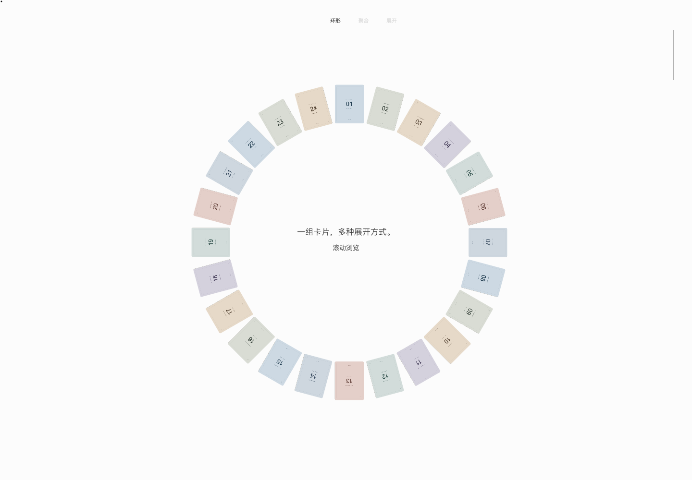
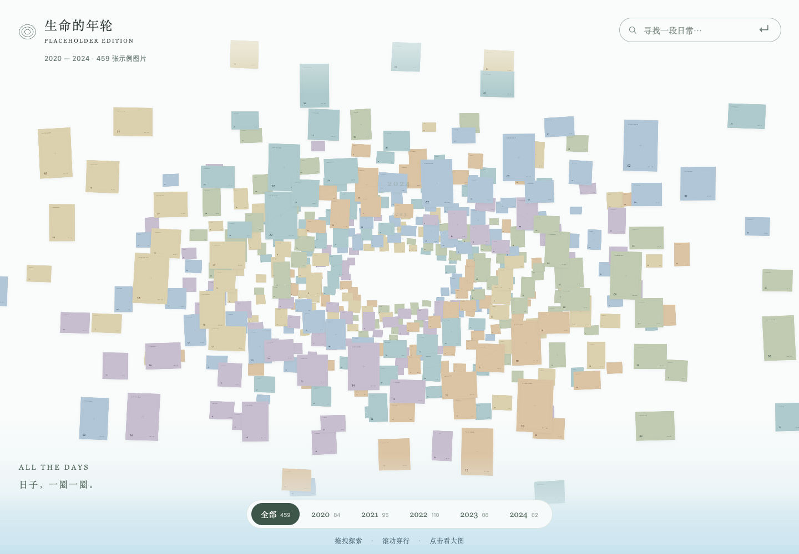
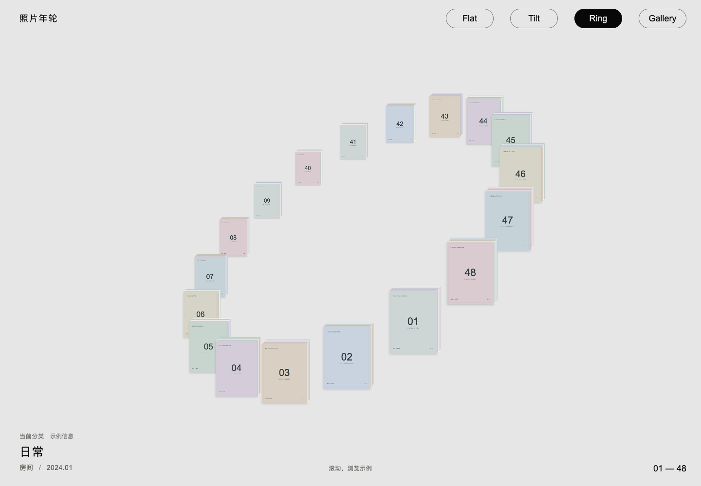

# Create Photo Flipbook UI

**English** · [简体中文](README.zh-CN.md)

## [Visit the website →](https://haichaolihc.github.io/create-photo-flipbook-ui/)

**[Explore the project and try the interactive demo](https://haichaolihc.github.io/create-photo-flipbook-ui/)** · [中文网站](https://haichaolihc.github.io/create-photo-flipbook-ui/zh/) · [Full-screen demo](https://haichaolihc.github.io/create-photo-flipbook-ui/demo.html)

Create a photo flipbook from your photos with a Codex skill that curates images, designs expressive photobook spreads, and builds an interactive page-turning website. The skill uses the bundled **2D Book** runtime (formerly v1) in [`assets/html/`](skills/create-photo-flipbook-ui/assets/html/).

The website supports English and Simplified Chinese. On the main URL, it uses your browser’s preferred supported language; the language switch remembers your choice. This README has a separate [Chinese translation](README.zh-CN.md).

The project website and GitHub Pages build live in [`website/`](website/). Reusable UI templates live separately in [`ui-collections/`](ui-collections/).

## UI collections

These templates live in `ui-collections/`, outside the skill folder, and are optional resources for people to copy and customize. They are not installed with the skill. The skill uses its own bundled 2D runtime; the library, 3D readers, film archive, and spatial galleries are separate alternatives.

| [Library](ui-collections/library/) | [2D Book](ui-collections/2d-book/) |
| --- | --- |
|  |  |
| Reorderable shelf with three empty mock books. | Reference example of the skill’s bundled 2D runtime. |

| [3D Book 1](ui-collections/3d-book-1/) | [3D Book 2](ui-collections/3d-book-2/) |
| --- | --- |
|  |  |
| React and WebGL reader with curved pages and a dark stage. | Three.js and Quick FlipBook reader with a light stage and soft shadows. |

| [Card Gallery](ui-collections/card-gallery/) | [Image Atlas](ui-collections/image-atlas/) | [Photo Ring](ui-collections/photo-ring/) |
| --- | --- | --- |
|  |  |  |
| Scroll or drag cards through a ring, an arc, a stack, and an unfolded strip. | Explore a spatial archive of concentric year rings, with theme search and focused image browsing. | Switch between Flat, Tilt, Ring, and Gallery layouts while preserving your browsing position. |

These three galleries use vanilla HTML, CSS, and JavaScript with local SVG
placeholders and fictional sample content—no personal photographs or external
image requests. No install or build step is needed; see each linked README for
preview instructions and how to add your own images.

## Install

```bash
python3 ~/.codex/skills/.system/skill-installer/scripts/install-skill-from-github.py \
  --repo HaichaoLihc/create-photo-flipbook-ui \
  --path skills/create-photo-flipbook-ui \
  --ref main
```

## Use

```text
Use $create-photo-flipbook-ui to turn these photographs into photobooks.
```

One workflow, three stages:

1. **Understand the photos:** their form, content, and themes. Semantic search and contact sheets are available.
2. **Define the style and design:** fulfill the user's request with a coherent, high-quality book. Pinterest, the photo-skill catalogue, and image generation are available. Without a preferred style, preserve the original photos and use the bundled default photobook style.
3. **Build the UI:** present the book with the built-in 2D HTML runtime and deliver a working local URL.

The skill defines outcomes and provides tools. The agent chooses the process.

The [default photobook style](skills/create-photo-flipbook-ui/references/default-style.md) provides concise text guidance, Source Serif 4, paper and cloth textures, and reusable page styles in the bundled runtime. The starter contains no sample photographs.

## Photo search and reusable code

The skill declares the existing `photo-search` MCP dependency for library search, ranked contact sheets, and larger previews. The MCP itself is read-only. The bundled `scripts/photo_library.py` adapter adds folder-specific cached indexes and semantic searches by reusing an installed photo-search engine's `index.py` and `PhotoSearchEngine`; it does not replace the connected MCP's global index.

Install the engine and its Python requirements separately, set `PHOTO_SEARCH_ENGINE_DIR` to its location, and use its Python interpreter. See [Photo library setup and commands](skills/create-photo-flipbook-ui/references/photo-library.md). Index caches remain outside the skill and source folders. New and changed images are embedded incrementally; unchanged images are reused. Search output includes a contact sheet and manifest, and selections retain stable IDs and original paths.

Reusable resources shipped with the skill include the photo-library adapter, ordered contact-sheet renderer, Pinterest helper, and 2D book runtime. Art direction and sequencing remain in workflow instructions. Model weights and photo libraries are not part of the skill package.

See each template’s README for local preview instructions.

[Negative Sleeves](ui-collections/film-negative-flipbook/) is a separate, photo-free film archive
UI with page-corner previews, draggable film strips, reversible single-frame
inspection, and optional continuously paginated semantic search. Import a local
photo folder with its Python builder; generated books and photographs stay Git-ignored.

## Validate

```bash
python3 tests/validate_repo.py
```

[Evaluation guide](evals/README.md).

## License

Original project code and the installable skill are [MIT licensed](LICENSE). Third-party components retain their own licenses. The adapted code in `ui-collections/3d-book-1/` and all photographs, videos, and other media are excluded unless expressly stated otherwise.
