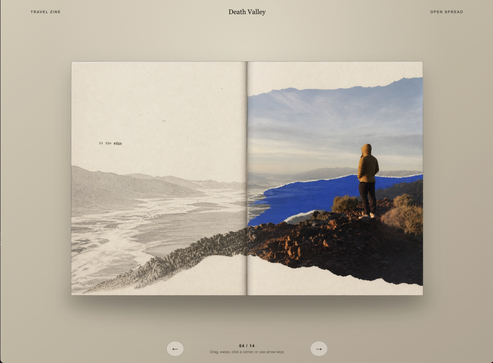

# Create Photo Flipbook UI

A Codex skill for turning photographs into expressive photobooks using the bundled **2D Book** runtime (formerly v1) in [`assets/html/`](skills/create-photo-flipbook-ui/assets/html/).

[3D Book 2 demo](https://haichaolihc.github.io/create-photo-flipbook-ui/)

## Templates

These templates live in `examples/`, outside the skill folder, and are optional resources for people to copy and customize. They are not installed with the skill. The skill uses its own bundled 2D runtime; Library and the 3D templates are separate alternatives.

| [Library](examples/library/) | [2D Book](examples/2d-book/) |
| --- | --- |
|  |  |
| Reorderable shelf with three empty mock books. | Reference example of the skill’s bundled 2D runtime. |

| [3D Book 1](examples/3d-book-1/) | [3D Book 2](examples/3d-book-2/) |
| --- | --- |
|  |  |
| React and WebGL reader with curved pages and a dark stage. | Three.js and Quick FlipBook editor with a custom timeline, per-scene copy, and soft shadows. |

## Install

```bash
python3 ~/.codex/skills/.system/skill-installer/scripts/install-skill-from-github.py \
  --repo HaichaoLihc/create-photo-flipbook-ui \
  --path skills/create-photo-flipbook-ui \
  --ref main
```

## Use

```text
Use $create-photo-flipbook-ui to turn these photographs into photobooks.
```

The skill selects photo skills, edits the book sequence, and creates complete covers and spreads. For finished pages, ask it to assemble them as-is, preserving their order.

See each template’s README for local preview instructions.

## Validate

```bash
python3 tests/validate_repo.py
```

[Evaluation guide](evals/README.md).

## License

Original project code and the installable skill are [MIT licensed](LICENSE). Third-party components retain their own licenses. The adapted code in `examples/3d-book-1/` and all photographs, videos, and other media are excluded unless expressly stated otherwise.
